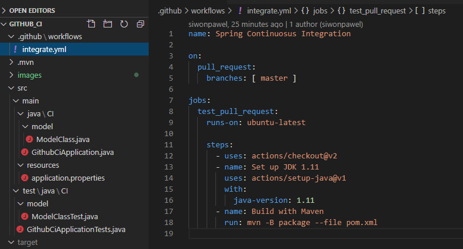
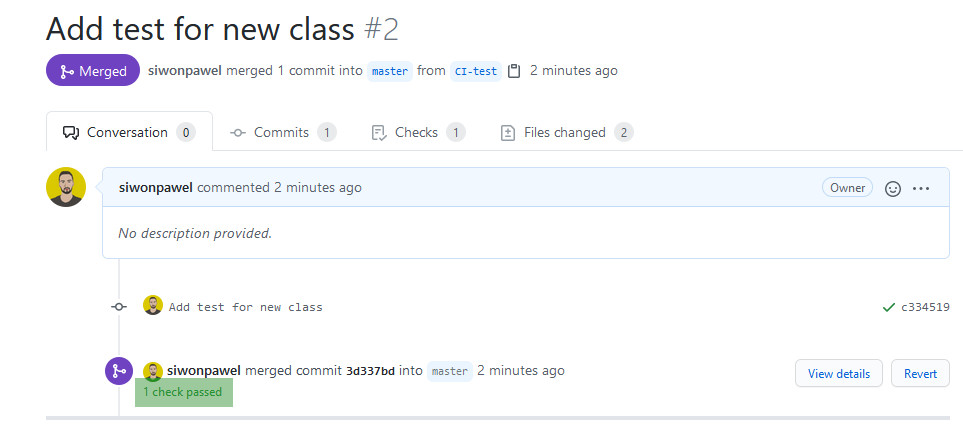
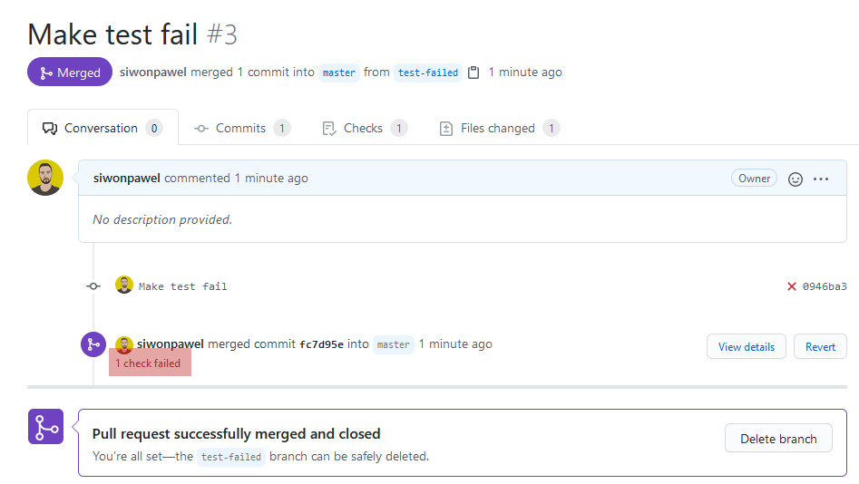
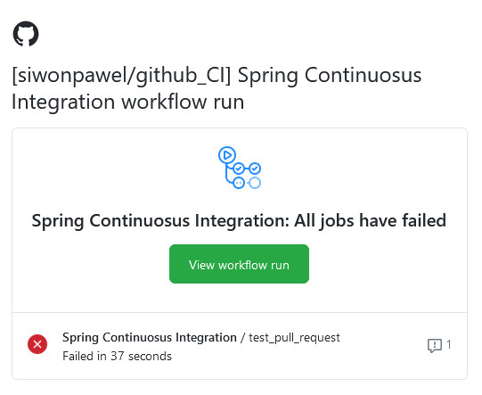

# Github actions 
First try-out of Github actions to deliver testing of software when making changes to master branch.
## Configuration

## Successful testing on merge

## Testing failed on merge

### Recived email after fail
